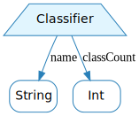
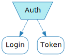
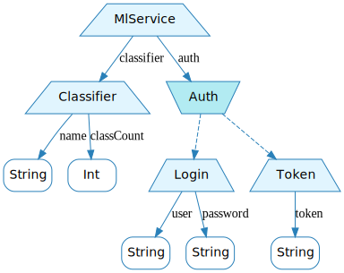

Before we can talk about optics proper, we need to lay a bit of groundwork. We'll need to understand what Algebraic Data Types (ADTs) are. Luckily, we can explain that as we build our motivating example.

## Classifier

The first data type we'll be working with throughout this article is `Classifier`, in the sense of a machine learning classifier. If you reduce that to its simplest possible expression (and possibly slightly further), you get:

```scala
case class Classifier(
  name      : String,
  classCount: Int
)
```

A `Classifier` is composed of two things: a name, used to identify it, *and* a class count, which you use to make sense of the probability distribution it yields. A `String` *and* an `Int`.

That *and* keyword is extremely important: it's the defining feature of a *product type*. An aggregation of types, using *and* as the aggregating operator.

I'll be using the following diagram to represent product types:

<span class="figure">

</span>

Where:
* the trapezium with a fat base (`Classifier`) represents the product type itself.
* each arrow represents a field in the product type, and is labeled with its name.
* the blue boxes at the bottom (`String` and `Int`) are the types of these fields.

The trapezium shape is supposed to look like `⋀`, the *and* mathematical operator.


## Auth
In our example, we're accessing classifiers through an HTTP API, which is protected by authentication. We currently support two authentication mechanisms:
* token-based: we've been provided with a unique token that the server will trust.
* login-based: we have an account on the remote service and use raw login and passwords - through basic-auth, for, example.

Here's the Scala code that corresponds to this:

```scala
sealed trait Auth

case class Token(
  token: String
) extends Auth

case class Login(
  user    : String,
  password: String
) extends Auth
```

`Auth` is flagged as `sealed`, which means that the only two possible implementations are `Token` and `Login`: an `Auth` is either a `Token` *or* `Login`.

Note the *or* keyword: that's the defining feature of a *sum type*. It's an aggregation of types, using *or* as the aggregating operator.

I'll be using the following diagram to represent sum types:

<span class="figure">

</span>

Where:
* the trapezium with a slim base (`Auth`) represents the sum type itself.
* each arrow represents one possible value the sum type can take. They're dashed to signify that it's only a possibility - an `Auth` *might* be a `Token`, but doesn't *have* to be.
* the blue boxes at the bottom (`Login` and `Token`) are the types of these possible values.

The trapezium shape is supposed to look like `∨`, the *or* mathematical operator.


## MlService

Finally, we need to bring `Classifier` and `Auth` together - we need some type to aggregate both, so that we can have all the information needed to connect to a remote service in a single value.

We'll need a `Classifier` *and* an `Auth`. We've seen that before, it's a product type:

```scala
case class MlService(
  auth      : Auth,
  classifier: Classifier
)
```

Note how this is a product type composed of a product type and a sum type. This is generally what we mean when we talk about ADTs: nested product and sum types.

`MlService` can be represented with the following graph:

<span class="figure">

</span>

## Key takeaways

While writing the data structure we'll be using throughout the article, we have defined the following:
* a *product type* can be seen as an *and* between types.
* a *sum type* can be seen as an *or* between types.
* the word *ADT* is usually used to describe nested sum and product types.

With that knowledge in hand, we can now start talking about optics. The first one we'll concern ourselves with is *lens*.
