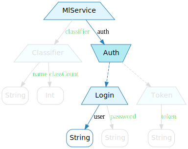
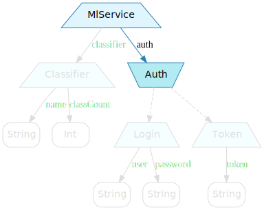
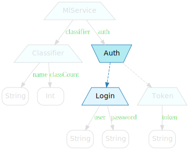
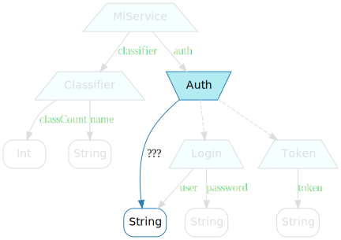
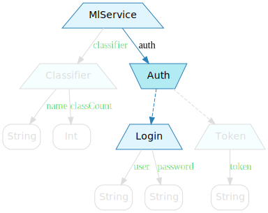
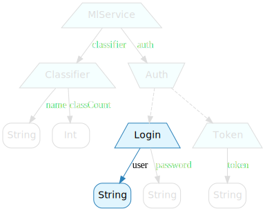

When motivating lenses, we used the following service:

```scala
val service = MlService(
  Login("jsmith", "Tr0ub4dor&3"),
  Classifier("news20", 20)
)
```

This time, instead of changing the classifier name, we'll be attempting to change the login user:

<span class="figure">

</span>

Right away, we notice that this is slightly different: the `Auth` → `Login` part of our path is of a kind we've not yet dealt with.

We have also seen that a good approach was to take things one step at a time and composing the results. Let's try to do that here as well.

## Service → Auth

The first part of our complete path is something we're quite familiar with by now: a lens from `MlService` to `Auth`.

<span class="figure">

</span>

The code is essentially the same as what we've done so far:

```scala
val serviceAuth = Lens[MlService, Auth](
  setter = (a, s) => s.copy(auth = a),
  getter = s      => s.auth
)
```

## Auth → Login

Going from `Auth` to `Login`, on the other hand, is more problematic. `Auth` is a sum type, not a product type, and we don't really have a tool to deal with that yet.

<span class="figure">

</span>

There's two ways we can deal with this situation: the correct one, and the one everybody kinds of want to try at this point. We could pretend that the problem doesn't exist and soldier on with the tools we already have - sort of sweep the issue under a rug and see where that takes us.

That's actually a perfectly fine approach. From experience, we can be pretty certain this won't work out; there will come a point where we'll get stuck. But that's ok! We'll have learned something about the problem, and in so doing, be one step closer to solving it.

## Auth → user?

Since we don't really know how to go from `Auth` to `Login`, let's see if we can't sidestep the whole thing and go directly to the login user:

<span class="figure">

</span>

The code would look something like that:

```scala
val authUser = Lens[Auth, String](
  setter = (a, s) => ???,

  // Auth -> String
  getter = s => s match {
    case Login(user, _) => user
    case Token(token)   => ???
  }
)
```

But we get stuck writing the `getter`. If our `Auth` is `Login`, there is no problem: a `Login` has a user name and we can simply return that. What about if our `Auth` is a `Token` though?

We *could* reason that while we don't have a user name to return, our method must return a `String`, and `Token` does have a `String` we could return... I'm going to pretend you didn't think that, however. Shame on you.

## Auth → Login

We're back to attempting to go from `Auth` to `Login`.

<span class="figure">

</span>

This time however, we're armed with a bit more knowledge: it's clear that lenses can't solve our issue, because we need something that has a notion of optionality. Our `Auth` might not be a `Login`, and our structure must reflect that.

We have another, much more urgent problem to solve first. How are we going to name that structure? It allows us to... sort of... diffract a sum type into its various parts? In keeping with the optics theme, this is, of course, a *prism*.

## Prism

A prism looks a lot like a lens, with a few key differences:

```scala
trait Prism[S, A] {
  def set(a: A): S
  def get(s: S): Option[A]

  def modify(f: A => A)(s: S): S = get(s) match {
    case Some(a) => set(f(a))
    case None    => s
  }
}
```

The `get` method is where we introduce the notion that we might not actually have a value to return. Instead of always returning an `A` like a `Lens` does, we return an `Option[A]`.

This is how you'd use it:

```scala
val authLogin: Prism[Auth, Login] = ???

val login: Option[Login] = authLogin.get(service.auth)
// res1: Option[Login] = Some(Login(psmith,Tr0ub4dor&3))
```

The `set` method is a bit more surprising. Remember how it worked for a `Lens`? Given an `S` and an `A`, it'd stick the `A` inside of the `S`. For example, it'd set the name of the classifier associated with a service.

With a `Prism` though, we only take an `A`. That's because, instead of putting a value inside of another, we're replacing one by another. We have a `Login`, and we want to turn that into an `Auth`:

```scala
val updated: Auth = authLogin.set(Login("foo", "bar"))
// res2: Auth = Login(foo,bar)
```

As with lenses, we'll need a creation helper:

```scala
object Prism {
  def apply[S, A](
    setter: A => S,
    getter: S => Option[A]
  ) = new Prism[S, A] {
    override def set(a: A) = setter(a)
    override def get(s: S) = getter(s)
  }
}
```

That `getter` part is going to be a problem, however. It's a total function, which means we'll need to write large pattern matches that deal with every possible case. We can do better through Scala's `PartialFunction`:

```scala
object Prism {
  def apply[S, A](
    setter: A => S,
    getter: S => Option[A]
  ) = new Prism[S, A] {
    override def set(a: A) = setter(a)
    override def get(s: S) = getter(s)
  }

  def fromPartial[S, A](
    setter: A => S,
    getter: PartialFunction[S, A]
  ) = Prism(setter, getter.lift)
}
```

Let's create a `Prism` to see why that `fromPartial` method is useful.

## Auth → Login

This is what we're trying to achieve:

<span class="figure">

</span>

And here's the corresponding prism:

```scala
val authLogin = Prism.fromPartial[Auth, Login](
  setter = a => a,
  getter = { case s: Login => s }
)
```

Notice how the `getter` is a simple pattern match that only deals with the part we're interested in? That yields a `PartialFunction[S, A]`, which is exactly what `fromPartial` expects.

The `setter` is essentially an upcast, since a `Login` is an `Auth`.


## Service → Login

We now have a lens from `MlService` to `Auth`, and a prism from `Auth` to `Login`. We need only compose them to go from `MlService` to `Login`:

<span class="figure">

</span>

But... how do we compose a lens and a prism? Is this something we already have the tools to deal with?

## Lens ∘ Prism ≟ Prism

Could the composition of a lens and prism be a prism?

```scala
def composeLP[S, A, B](
  l: Lens[S, A],
  p: Prism[A, B]
) = Prism[S, B](
  // B => S
  setter = b => {
    val s: S = ???
    l.set(p.set(b))(s)
  },

  getter = s => ???
)
```
This is immediately problematic. We can't implement the setter: it's a function of `B` to `S`, but there's no way to get an `S` out of the `B`.

We can go from a `B` to an `A` through our prism's `set` method, but there's nothing in our lens that allows us to get one level up.

So, a lens and prism can't be a prism. Could it be a lens?

## Lens ∘ Prism ≟ Lens

Turns out, we hit a wall almost straight away:

```scala
def composeLP[S, A, B](
  l: Lens[S, A],
  p: Prism[A, B]
) = Lens[S, B](
  setter = (b, s) => ???,

  // S => B
  getter = s => {
    val ob: Option[B] = p.get(l.get(s))
    val b: B = ???
    b
  }
)
```

There's no way to implement the getter part. It's a function from `S` to `B`, and we can get an `Option[B]` through the prism, but there's no (sane) way to get the `B` out.

Clearly, we need a third tool. Something that mixes lenses and prisms...

## Optional

Yeah, the fancy optics naming scheme sort of falls apart here.

I've been told that the proper name is not optional but _affine traversal_. I usually feel it's better to pretend I've not heard that because it's _so much worse_.

An optional, defined as the result of composing a lens and a prism, must have the following properties:
* getting the nested data might fail - there might not be any data to get, just like for a prism.
* setting the nested data doesn't replace the entire value, just the part of it we're focusing on, just like a lens.

Which, in plain English, means that an Optional must have a lens' `set` and prism's `get`:

```scala
trait Optional[S, A] {
  def set(a: A)(s: S): S
  def get(s: S): Option[A]

  def modify(f: A => A)(s: S): S = get(s) match {
    case Some(a) => set(f(a))(s)
    case None    => s
  }
}
```

As usual, we could use a creation helper:

```scala
object Optional {
  def apply[S, A](
    setter: (A, S) => S,
    getter: S      => Option[A]
  ) = new Optional[S, A] {
    override def set(a: A)(s: S) = setter(a, s)
    override def get(s: S)       = getter(s)
  }
}
```

## Composition galore

At this point, we have 3 tools - lenses, prisms and optionals - which should compose. We know how to compose lenses (yields a lens) and a lens and prism (yields an optional).

What about all other combinations? I'll write the code for them here, but you should feel entirely free to skip it. The interesting part is not the code itself, but the result type for each composition.

### Prism ∘ Prism

```scala
def composePP[S, A, B](
  p1: Prism[S, A],
  p2: Prism[A, B]
) = Prism[S, B](
  setter = b => p1.set(p2.set(b)),
  getter = s => p1.get(s).flatMap(p2.get)
)
```

A prism composed with a prism yields a prism.

### Prism ∘ Lens

```scala
def composePL[S, A, B](
  p: Prism[S, A],
  l: Lens[A, B]
) = Optional[S, B](
  setter = (b, s) => p.modify(l.set(b))(s),
  getter = s      => p.get(s).map(l.get)
)
```

A prism composed with a lens yields an optional.

### Lens ∘ Prism

```scala
def composeLP[S, A, B](
  l: Lens[S, A],
  p: Prism[A, B]
) = Optional[S, B](
  setter = (b, s) => l.set(p.set(b))(s),
  getter = s      => p.get(l.get(s))
)
```

A lens composed with a prism yields an optional.

### Optional ∘ Optional

```scala
def composeOO[S, A, B](
  o1: Optional[S, A],
  o2: Optional[A, B]
) = Optional[S, B](
  setter = (b, s) => o1.modify(o2.set(b))(s),
  getter = s      => o1.get(s).flatMap(o2.get)
)
```

An optional composed with an optional yields an optional.

### Optional ∘ Prism

```scala
def composeOP[S, A, B](
  o: Optional[S, A],
  p: Prism[A, B]
) = Optional[S, B](
  setter = (b, s) => o.set(p.set(b))(s),
  getter = s      => o.get(s).flatMap(p.get)
)
```

An optional composed with a prism yields an optional.


### Prism ∘ Optional

```scala
def composePO[S, A, B](
  p: Prism[S, A],
  o: Optional[A, B]
) = Optional[S, B](
  setter = (b, s) => p.modify(o.set(b))(s),
  getter = s      => p.get(s).flatMap(o.get)
)
```

A prism composed with an optional yields an optional.

### Optional ∘ Lens

```scala
def composeOL[S, A, B](
  o: Optional[S, A],
  l: Lens[A, B]
) = Optional[S, B](
  setter = (b, s) => o.modify(l.set(b))(s),
  getter = s      => o.get(s).map(l.get)
)
```

An optional composed with a lens yields an optional.

### Lens ∘ Optional

```scala
def composeLO[S, A, B](
  l: Lens[S, A],
  o: Optional[A, B]
) = Optional[S, B](
  setter = (b, s) => l.modify(o.set(b))(s),
  getter = s      => o.get(l.get(s))
)
```

A lens composed with an optional yields an optional.

### Compositions

The one interesting thing to note was that:
* composing a lens with a lens yields a lens.
* composing a prism with a prism yields a prism.
* *everything else* yields an optional.

When working with ADTs, you'll end up using optionals more often than not.

## Service → Login

Now that we know how to compose all these things together, we can get back to where we were previously blocked:

<span class="figure">

</span>

Since we already have the building blocks (`MlService` → `Auth` → `Login`), we can just compose them:

```scala
val serviceLogin = composeLP(
  serviceAuth,
  authLogin
)
```

## Login → user

The last step in our path is from `Login` to `String`:


<span class="figure">

</span>

This can be easily achieved with a lens:

```scala
val loginUser = Lens[Login, String](
  setter = (a, s) => s.copy(user = a),
  getter = s      => s.user
)
```

## Service → user

We finally have everything we need to go from `MlService` to `Login.user`:


<span class="figure">

</span>

Composing the bits we've built so far is enough to do the trick:

```scala
val serviceUser = composeOL(
  serviceLogin,
  loginUser
)
```

And we can now fairly straightforwardly modify the login user associated with a service:

```scala
serviceUser.set("psmith")(service)
// res4: MlService = MlService(Login(psmith,Tr0ub4dor&3),Classifier(news20,20))
```

## Key takeaways

In order to work with both sum types and product types, we've had to extend our toolkit to include _prisms_ and _optionals_.

We've also discovered that all these things composed and that, mostly, you'd eventually end up working with _optionals_.

Creating optics does seem to involve a fair amount of boilerplate, however - lens implementations, for example, all look the same except for actual field names. It feels like there should be some mechanisms for automating that.
